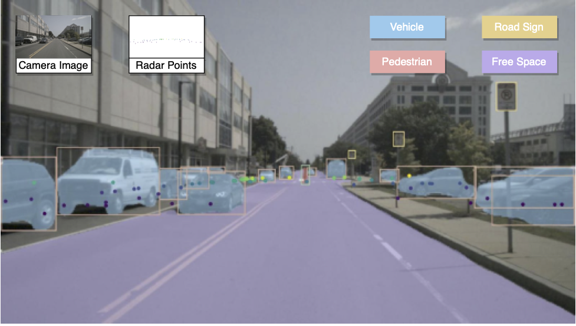
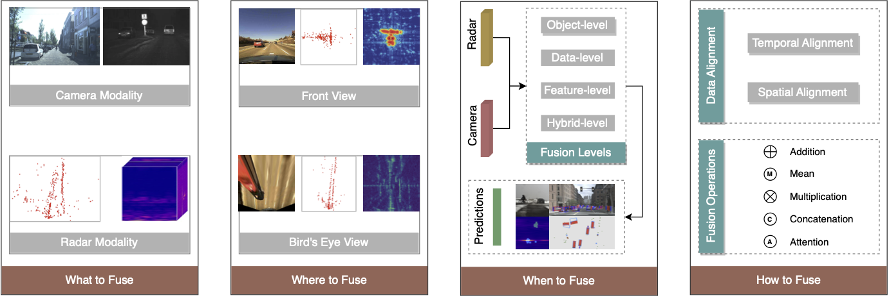

#   Awesome Radar-Camera Fusion 

 

## Overview

- [Surveys](#surveys)
- [Datasets](#datasets)
- [Methods](#methods)
- [Radar-Camera](#radar-camera)
  - [Detection](#detection)
  - [Segmentation](#segmentation)
  - [Tracking](#tracking)
  - [Odometry](#odometry)
  - [Multi-Task](#multi-task)
- [Radar-LiDAR](#radar-lidar)
  - [Detection](#detection-1)
- [Camera-LiDAR](#camera-lidar)
  - [Detection](#detection-2)
- [Camera-LiDAR-Radar](#camera-lidar-radar)
  - [Detection](#detection-3)
- [Citation](#citation)

## Surveys

* 2023 - Radar-Camera Fusion for Object Detection and Semantic Segmentation in Autonomous Driving: A Comprehensive Review __`TIV`__ [[Paper](https://ieeexplore.ieee.org/document/10225711)] [[Website](https://radar-camera-fusion.github.io)] [[GitHub](https://github.com/Radar-Camera-Fusion/Awesome-Radar-Camera-Fusion)]
* 2021 - Deep Multi-Modal Object Detection and Semantic Segmentation for Autonomous Driving: Datasets, Methods, and Challenges __`TITS`__ [[Paper](https://ieeexplore.ieee.org/abstract/document/9000872)] [[Website](https://boschresearch.github.io/multimodalperception/)]
* 2023 - Vision-RADAR fusion for Robotics BEV Detections: A Survey __`IV`__ [[Paper](https://ieeexplore.ieee.org/abstract/document/10186647)]
* 2023 - Radar Perception in Autonomous Driving: Exploring Different Data Representations __`arXiv`__ [[Paper](https://arxiv.org/abs/2312.04861)] [[Website](https://radar-camera-fusion.github.io/radar)] [[GitHub](https://github.com/Radar-Camera-Fusion/Awesome-Radar-Perception)]
  
## Datasets
| Id | Name             | Year | Task                                                                                                      | Annotation                     | Radar Data Representation                                   | Link                                                         |
|----|------------------|------|-----------------------------------------------------------------------------------------------------------|--------------------------------|-------------------------------------------------------------|--------------------------------------------------------------|
| 1  | nuScenes         | 2019 | Object Detection<br>Object Tracking                                                                       | 3D box                   | Point Cloud                                                 | [Website](https://www.nuscenes.org/nuscenes) [Github](https://github.com/nutonomy/nuscenes-devkit)                           |
| 2  | Astyx            | 2019 | Object Detection                                                                                          | 3D box                   | Point Cloud                                                 | [Website](http://www.astyx.net)                                         |
| 3  | SeeingThroughFog | 2020 | Object Detection                                                                                          | 2D box<br>3D box   | Point Cloud                                                 | [Website](https://www.uni-ulm.de/en/in/driveu/projects/dense-datasets/) |
| 4  | CARRADA          | 2020 | Object Detection<br>Semantic Segmentation<br>Object Tracking<br>Trajectory Prediction                     | 2D box<br>2D pixel | Range-Doppler Tensor<br>Range-Azimuth Tensor                | [Website](https://arthurouaknine.github.io/codeanddata/carrada)                                                             |
| 5  | HawkEye          | 2020 | Semantic Segmentation                                                                                     | 3D point                 | Point Cloud                                                 | [Website](https://jguan.page/HawkEye/)                                                             |
| 6  | Zendar           | 2020 | Object Detection<br>Mapping<br>Localization                                                               | 2D box                   | Range-Doppler Tensor<br>Range-Azimuth Tensor<br>Point Cloud | [Website](http://zendar.io/dataset)                                                          |
| 7  | RADIATE          | 2020 | Object Detection<br>Object Tracking<br>SLAM<br>Scene Understanding                                        | 2D box                   | Range-Azimuth Tensor                                        | [Website](http://pro.hw.ac.uk/radiate/)                                                            |
| 8  | AIODrive         | 2020 | Object Detection<br>Object Tracking<br>Semantic Segmentation<br>Trajectory Prediction<br>Depth Estimation | 2D box<br>3D box   | Point Cloud                                                 | [Website](http://www.aiodrive.org/)                                                            |
| 9  | CRUW             | 2021 | Object Detection                                                                                          | 2D box                   | Range-Azimuth Tensor                                        | [Website](https:/www.cruwdataset.org/)                                                             |
| 10 | RaDICaL          | 2021 | Object Detection                                                                                          | 2D box                   | ADC Signal                                                  | [Website](https://publish.illinois.edu/radicaldata/)                                                             |
| 11 | RadarScenes | 2021 | Object Detection<br>Semantic Segmentation <br>Object Tracking   | 2D pixel<br>3D point | Point Cloud                                                                                               |  [Website](https://radar-scenes.com/) |
| 12 | RADDet      | 2021 | Object Detection                             | 2D box<br>3D box     | Range-Azimuth-Doppler Tensor                                                                                              |  [Github](https://github.com/ZhangAoCanada/RADDet) |
| 13 | FloW        | 2021 | Object Detection                             | 2D box                     | Range-Doppler Tensor<br>Point Cloud                                                                                               | [Website](https://orca-tech.cn/datasets/FloW/Introduction) [Github](https://github.com/ORCA-Uboat/FloW-Dataset)  |
| 14 | RADIal      | 2021 | Object Detection<br>Semantic Segmentation    | 2D box                     | ADC Signal<br>Range-Azimuth-Doppler Tensor<br>Range-Azimuth Tensor<br>Range-Doppler Tensor<br>Point Cloud             |  [Github](https://github.com/valeoai/RADIal) |
| 15 | VoD         | 2022 | Object Detection                             | 2D box<br>3D box     | __`4D`__ Point Cloud                                                                                                         | [Website](https://tudelft-iv.github.io/view-of-delft-dataset/)  |
| 16 | Boreas      | 2022 | Object Detection<br>Localization<br>Odometry | 2D box                     | Range-Azimuth Tensor                                                                                                  |  [Website](https://www.boreas.utias.utoronto.ca/) |
| 17 | TJ4DRadSet  | 2022 | Object Detection<br>Object Tracking          | 3D box                     | __`4D`__ Point Cloud                                                                                                               | [Website](https://github.com/TJRadarLab/TJ4DRadSet)  |
| 18 | K-Radar     | 2022 | Object Detection<br>Object Tracking<br>SLAM  | 3D box                     | __`4D`__ Range-Azimuth-Doppler Tensor                                                                                                         | [Github](https://github.com/kaist-avelab/k-radar)  |
| 19 | aiMotive    | 2022 | Object Detection                             | 3D box                     | Point cloud                                                                                                                       |  [Website](https://github.com/aimotive/aimotive_dataset) |
| 20 | WaterScenes    | 2023 | Instance Segmentation<br>Semantic Segmentation<br>Free-space Segmentation<br>Waterline Segmentation<br>Panoptic Perception          | 2D box<br>2D pixel<br>2D line<br>3D point               | __`4D`__ Point cloud                                                           |  [Paper](https://arxiv.org/abs/2307.06505) [Website](https://waterscenes.github.io) [GitHub](https://github.com/waterscenes/waterscenes) |
| 21 | ThermRad | 2023 | Object Detection | 3D box | __`4D`__ Point Cloud | [Paper](https://arxiv.org/abs/2308.10161)|
| 22 | Dual Radar | 2023 | Object Detection<br>Object Tracking | 3D box | __`4D`__ Point Cloud | [Paper](https://arxiv.org/abs/2310.0760) [GitHub](https://github.com/adept-thu/Dual-Radar)|


## Methods
| Id | Short Name       | Year | Task                                      | Annotation                     | Radar Data Representation | Fusion Level  | Dataset                         | Link                                    |
|----|------------------|------|-------------------------------------------|--------------------------------|---------------------------|---------------|---------------------------------|------------------------------------------------|
| 1  | Chadwick et al.  | 2019 | Object Detection                          | 2D box                   | Point Cloud               | Feature Level | Self-Recorded                   |                                                |
| 2  | RRPN             | 2019 | Object Detection                          | 2D box                   | Point Cloud               | Data Level    | nuScenes                        | [Code](https://github.com/mrnabati/RRPN)               |
| 3  | Jha et al.       | 2019 | Object Detection                          | 2D box                   | Point Cloud               | Object Level  | Self-Recorded                   |                                                |
| 4  | CMGGAN           | 2019 | Semantic Segmentation                     | 2D point                 | Grid Map                  | Feature Level | Self-Recorded                   |                                                |
| 5  | Meyer and Kuschk | 2019 | Object Detection                          | 3D box                   | Point Cloud               | Data Level    | Astyx                           |                                                |
| 6  | RVNet            | 2019 | Object Detection                          | 2D box                   | Point Cloud               | Feature Level | nuScenes                        |                                                |
| 7  | FusionNet        | 2019 | Object Detection<br>Object Classification | 2D box                   | Range-Azimuth Tensor      | Feature Level | Self-Recorded                   |                                                |
| 8  | SO-Net           | 2020 | Object Detection<br>Semantic Segmentation | 2D box<br>2D pixel | Point Cloud               | Feature Level | nuScenes                        |                                                |
| 9  | SAF-FCOS         | 2020 | Object Detection                          | 2D box                   | Point Cloud               | Feature Level | nuScenes                        | [Code](https://github.com/Singingkettle/SAF-FCOS)      |
| 10 | CRF-Net          | 2019 | Object Detection                          | 2D box                   | Point Cloud               | Data Level    | nuScenes <br> Self-Recorded | [Code](https://github.com/TUMFTM/CameraRadarFusionNet) |
| 11 | Bijelic et al. | 2020 | Object Detection                 | 2D box | Point Cloud                  | Feature Level | DENSE         | [Code](https://github.com/princeton-computational-imaging/SeeingThroughFog)            |
| 12 | BIRANet        | 2020 | Object Detection                 | 2D box | Point Cloud                  | Feature Level | nuScenes      | [Code](https://github.com/RituYadav92/Radar-RGB-Attentive-Multimodal-Object-Detection) |
| 13 | Nabati and Qi  | 2020 | Object Detection<br>Depth Estimation | 2D box | Point Cloud              | Mixed Level   | nuScenes      |                                                                                |
| 14 | YOdar          | 2020 | Object Detection                 | 2D box | Point Cloud                  | Feature Level | nuScenes      |                                                                                |
| 15 | CenterNet      | 2020 | Object Detection                 | 3D box | Point Cloud                  | Feature Level | nuScenes      | [Code](https://github.com/mrnabati/CenterFusion)                                       |
| 16 | RODNet         | 2020 | Object Detection                 | 2D box | Range-Azimuth Tensor         | Feature Level | CRUW          | [Code](https://github.com/yizhou-wang/RODNet)                                          |
| 17 | RAMP-CNN       | 2021 | Object Detection                 | 2D box | Range-Azimuth-Doppler Tensor | Feature Level | CRUW          |                                                                                |
| 18 | Li and Xie     | 2021 | Object Detection                 | 3D box | Point Cloud                  | Feature Level | nuScenes      |                                                                                |
| 19 | Kim et al.     | 2020 | Object Detection                 | 3D box | Range-Azimuth Tensor         | Feature Level | Self-Recorded |                                                                                |
| 20 | AssociationNet | 2021 | Object Detection                 | 2D box | Point Cloud                  | Object Level  | Self-Recorded |                                                                                |
| 21 | RVF-Net        | 2021 | Object Detection      | 3D box               | Point Cloud                         | Data Level    | nuScenes                       |             |
| 22 | Cui et al.     | 2021 | Object Detection      | 3D box               | Point Cloud                         | Mixed Level   | Astyx                          |             |
| 23 | RISFNet        | 2021 | Object Detection      | 2D box               | Point Cloud                         | Feature Level | FloW                           |             |
| 24 | GRIF Net       | 2021 | Object Detection      | 3D box               | Point Cloud                         | Feature Level | nuScenes                       |             |
| 25 | Stacker et al. | 2021 | Object Detection      | 2D box               | Point Cloud                         | Feature Level | nuScenes                       |             |
| 26 | Harley et al.  | 2021 | Semantic Segmentation | 2D pixel             | Point Cloud                         | Feature Level | nuScenes                       |             |
| 27 | RadSegNet      | 2022 | Object Detection      | 2D box<br>2D pixel | Point Cloud<br>Range-Azimuth Tensor | Data    | Astyx<br>RADIATE               |             |
| 28 | RCBEV          | 2022 | Object Detection      | 3D box               | Point Cloud                         | Feature Level | nuScenes                       |             |
| 29 | CRAFT          | 2022 | Object Detection      | 3D box               | Point Cloud                         | Data Level    | nuScenes                       |             |
| 30 | DeepFusion     | 2022 | Object Detection      | 3D box               | Point Cloud                         | Feature Level | Self-reorded <br> nuScenes |             |
| 31 | CramNet    | 2022 | Object Detection | 3D box | Range-Azimuth Tensor      | Feature Level | RADIATE  |             |
| 32 | MVFusion   | 2023 | Object Detection | 3D box | Point Cloud               | Feature Level | nuScenes |             |
| 33 | CRN        | 2023 | Object Detection | 3D box | Point Cloud               | Feature Level | nuScenes |             |

## Radar-Camera
 

### Detection

* 2022 - Detecting Darting Out Pedestrians With Occlusion Aware Sensor Fusion of Radar and Stereo Camera  __`TIV`__ [[Paper](https://ieeexplore.ieee.org/document/9941368)]
* 2023 - **RCFusion**: Fusing 4-D Radar and Camera With Bird’s-Eye View Features for 3-D Object Detection [__`VoD`__ __`TJ4DRadSet`__]  __`TIM`__ [[Paper](https://ieeexplore.ieee.org/document/10138035)]
* 2023 - **LXL**: LiDAR Exclusive Lean 3D Object Detection with 4D Imaging Radar and Camera Fusion  [__`VoD`__ __`TJ4DRadSet`__]  __`TIV`__ [[Paper](https://arxiv.org/abs/2307.00724)]
* 2023 - **REDFormer**: Radar Enlightens the Darkness of Camera Perception with Transformers [__`nuScenes`__]  __`TIV`__ [[Paper](https://ieeexplore.ieee.org/document/10310160/)]
* 2023 - **SparseFusion3D**: Sparse Sensor Fusion for 3D object detection by Radar and Camera in Environmental Perception [__`nuScenes`__]  __`TIV`__ [[Paper](https://ieeexplore.ieee.org/document/10314799)]

### Segmentation

### Tracking
* 2021 - A Novel Spatio-Temporal Synchronization Method of Roadside Asynchronous MMW Radar-Camera for Sensor Fusion __`TITS`__ [[Paper](https://ieeexplore.ieee.org/abstract/document/9590496)]
* 2021 - **CFTrack**: Center-based Radar and Camera Fusion for 3D Multi-Object Tracking __`IV Workshops`__ [[Paper](https://ieeexplore.ieee.org/abstract/document/9669223)]
* 2021 - 3D Detection and Tracking for On-road Vehicles with a Monovision Camera and Dual Low-cost 4D mmWave Radars __`ITSC`__ [[Paper](https://ieeexplore.ieee.org/document/9564904)]
* 2022 - Robust Target Recognition and Tracking of Self-Driving Cars With Radar and Camera Information Fusion Under Severe Weather Conditions __`TITS`__ [[Paper](https://ieeexplore.ieee.org/abstract/document/9363012)]

### Odometry
* 2023 - 4DRVO-Net: Deep 4D Radar–Visual Odometry Using Multi-Modal and Multi-Scale Adaptive Fusion __`TIV`__ [__`VoD`__][[Paper](https://ieeexplore.ieee.org/document/10313030)]

### Multi-Task
* 2023 - **Achelous**: A Fast Unified Water-surface Panoptic Perception Framework based on Fusion of Monocular Camera and 4D mmWave Radar [__`WaterScenes`__] __`ITSC`__  [[Paper](https://arxiv.org/abs/2307.07102)] [[GitHub](https://github.com/GuanRunwei/Achelous)]
* 2023 - **Mask-VRDet**: Mask-VRDet: A robust riverway panoptic perception model based on dual graph fusion of vision and 4D mmWave radar[__`WaterScenes`__] __`RAS`__  [[Paper](https://www.sciencedirect.com/science/article/pii/S0921889023002117)] [[GitHub](https://github.com/GuanRunwei/Mask-VRDet-Official)]
* 2023 - **Efficient-VRNet**: An Exquisite Fusion Network for Riverway Panoptic Perception based on Asymmetric Fair Fusion of Vision and 4D mmWave Radar [__`WaterScenes`__] __`arXiv`__  [[Paper](https://arxiv.org/abs/2308.10287)] [[GitHub](https://github.com/GuanRunwei/Efficient-VRNet)]


## Radar-LiDAR
### Detection
* 2021 - Robust multimodal vehicle detection in foggy weather using complementary lidar and radar signals __`CVPR`__ [[Paper](https://ieeexplore.ieee.org/document/9578621)]
* 2022 - **RaLiBEV**: Radar and LiDAR BEV Fusion Learning for Anchor Box Free Object Detection System [[Paper](https://arxiv.org/abs/2211.06108)]
* 2022 - Modality-agnostic learning for radar-lidar fusion in vehicle detection __`CVPR`__ [[Paper](https://ieeexplore.ieee.org/document/9879704)]
* 2022 - [**ST-MVDNet**] Modality-Agnostic Learning for Radar-Lidar Fusion in Vehicle Detection  [__`Oxford Radar Robotcar`__]__`CVPR`__ [[Paper](https://openaccess.thecvf.com/content/CVPR2022/html/Li_Modality-Agnostic_Learning_for_Radar-Lidar_Fusion_in_Vehicle_Detection_CVPR_2022_paper.html)]
* 2023 - **Bi-LRFusion**: Bi-Directional LiDAR-Radar Fusion for 3D Dynamic Object Detection __`CVPR`__ [[Paper](https://openaccess.thecvf.com/content/CVPR2023/html/Wang_Bi-LRFusion_Bi-Directional_LiDAR-Radar_Fusion_for_3D_Dynamic_Object_Detection_CVPR_2023_paper.html)]
* 2023 - Multi-Modal and Multi-Scale Fusion 3D Object Detection of 4D Radar and LiDAR for Autonomous Driving [__`Astyx`__] __`TVT`__ [[Paper](https://ieeexplore.ieee.org/abstract/document/9991894)]
* 2023 - **ST-MVDNet++**: Improve vehicle detection with lidar-radar geometrical augmentation via self-training __`ICASSP`__ [[Paper](https://ieeexplore.ieee.org/document/10096041/)]
* 2023 - **ACF-Net**: Asymmetric Cascade Fusion for 3D Detection With LiDAR Point Clouds and Images __`TIV`__ [[Paper](https://ieeexplore.ieee.org/abstract/document/10363115)]

## Camera-LiDAR
### Detection
* 2021 - Joint Multi-Object Detection and Tracking with Camera-LiDAR Fusion for Autonomous Driving __`IROS`__ [[Paper](https://ieeexplore.ieee.org/abstract/document/9636311)]
* 2023 - **RoboBEV**: Towards Robust Bird’s Eye View Perception under Corruptions [__`nuScenes`__] [[Paper](https://arxiv.org/abs/2304.06719) [Code](https://github.com/Daniel-xsy/RoboBEV)]

## Camera-LiDAR-Radar
### Detection 
* 2023 - [**BEV-Guide**] BEV-Guided Multi-Modality Fusion for Driving Perception __`CVPR`__ [[Paper](https://openaccess.thecvf.com/content/CVPR2023/html/Man_BEV-Guided_Multi-Modality_Fusion_for_Driving_Perception_CVPR_2023_paper.html)]
* 2023 - **DeepFusion**: A Robust and Modular 3D Object Detector for Lidars, Cameras and Radars __`IROS`__ [[Paper](https://ieeexplore.ieee.org/abstract/document/9981778)]

## Citation
Please use the following citation when referencing
```
@article{yao2023radar,
  author={Yao, Shanliang and Guan, Runwei and Huang, Xiaoyu and Li, Zhuoxiao and Sha, Xiangyu and Yue, Yong and Lim, Eng Gee and Seo, Hyungjoon and Man, Ka Lok and Zhu, Xiaohui and Yue, Yutao},
  journal={IEEE Transactions on Intelligent Vehicles}, 
  title={Radar-Camera Fusion for Object Detection and Semantic Segmentation in Autonomous Driving: A Comprehensive Review}, 
  year={2023},
  volume={},
  number={},
  pages={1-40},
  doi={10.1109/TIV.2023.3307157}}
```
